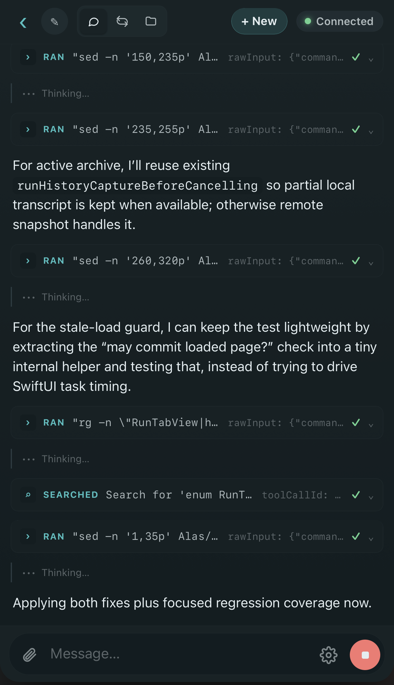

# Alas

**The workspace for the whole agent loop.**

Run coding agents in a terminal or a native chat pane, across every worktree,
on your Mac or over SSH. Review their work with comments they can actually
answer, and merge without leaving the app. Then pick the whole thing up from
your phone. Native macOS, terminals built on
[libghostty](https://github.com/ghostty-org/ghostty).


## Install

Requires macOS 15 Sequoia or later.

```bash
brew install --cask mrmans0n/tap/alas
```

Or grab the signed DMG from [Releases](https://github.com/mrmans0n/alas/releases/latest).

## Why Alas

Keep each task in its own worktree, with its terminals, agent conversations,
files, and diffs together. Review changes and send feedback to the agent in the
same window. When you step away, the phone client lets you follow the run and
respond when it needs you.

## Features

- **Run agents two ways.** A long-lived Ghostty terminal or a native chat pane
  over [ACP](https://agentclientprotocol.com). Tool
  calls, plans, and permission prompts render inline, and past sessions can be
  browsed and resumed. Works with Claude Code, Codex, Cursor, Gemini, OpenCode,
  Pi, OMP, and Copilot.

- **Prepare the next turn.** Queue, edit, reorder, or schedule prompts while an
  agent works. Attach issue context, dictate prompts, and configure external MCP
  servers per project.

- **Parallel worktrees, one window.** Every repo lives in the sidebar with its
  linked worktrees underneath. Switching is instant; terminal sessions, tabs, and
  scroll positions persist per worktree. Spaces organize repositories into
  focused sidebar groups.

  

- **Repo-defined MCP servers, shared through the repo.** Commit an
  `.alas/config.json` to your repository and every teammate's Alas picks it
  up: MCP servers, the repo's logo, and a default agent for new worktrees.
  Repo servers merge with your personal ones by name and are gated behind a
  one-time trust prompt, so a random repo can't attach commands without you
  approving it.

- **Remote machines, same workspace.** Add a project on an SSH host. A
  connection assistant reads `~/.ssh/config` and bootstraps a helper on the
  other side. Terminals, agents, file editing, search, and git all work over the
  wire, and remote agent runs keep going in the helper even when you disconnect.

- **Agents can drive the app.** A standalone `alas` CLI opens files, switches or
  creates worktrees, and starts reviews from the terminal. It's also
  auto-injected into every ACP session as an MCP server. Agents use it to open
  files at the right line, send you notifications, spin up delegated sessions,
  and work through your review comments.

- **A review loop agents can close.** Review a branch, commit, or range
  from the ⇧⌘R palette, and drop inline comments anywhere, changed
  lines or not. Agents read, reply to, and resolve those comments through the
  built-in review tools, so feedback becomes fixes instead of copy-paste.

  

- **Ship without the round-trip.** GitHub PRs and GitLab MRs detected on your
  branch, AI-drafted titles and descriptions, and a review-evidence inspector
  that pulls CI logs, check results, and test output next to the diff. Merge
  in-app, including through merge queues.

- **Drive from your phone.** Pair by QR, watch any session live, and take over a
  running desktop turn — send a prompt, stop a run, or answer a permission request
  from the couch. Browse worktree files and changes, create worktrees, and manage
  queued prompts in the web client. Push notifications fire when an agent needs you.

  <p align="center">
    
  </p>

- **Harness-aware.** Detects Claude Code, Codex, Cursor, Gemini, and friends
  running in your worktrees and shows live sidebar badges for busy agents,
  permission requests, and agents waiting for input. One-click hook install.

- **Git that gets out of the way.** File- and hunk-level staging, inline diffs
  with expandable context, stashes, per-file history, pull from upstream,
  AI-drafted commit messages, and a 3-way merge editor for conflicts.

- **A real editor underneath.** Tree-sitter syntax for 40+ languages, LSP-powered
  go-to-definition, hover docs, and completions, plus Markdown source-and-preview
  side-by-side. Markdown and chat can render Mermaid diagrams, and language
  servers can be installed from the code settings. Fuzzy file search and content
  search work across the workspace.

  

- **Preview web apps.** Open a web preview tab and run project scripts. Agents
  can inspect pages, click, type, and capture screenshots through the built-in
  browser tools.

- **Tabs for everything.** Terminals, agent sessions, file viewers, diffs,
  Markdown, and web previews open in tabs you can drag to reorder.

- **Native macOS app.** SwiftUI and AppKit, with signed and notarized releases.

Install and authenticate the agents you want to use. GitHub and GitLab features
use the `gh` and `glab` CLIs respectively, with their existing authentication.

## Repo-local configuration (`.alas/`)

A repository can ship shared Alas configuration in `.alas/`. Only **local**
projects read it in v1; projects on SSH hosts keep their existing behavior.
Everything in `.alas/config.json` is a *default*: anything you set per project
in the app wins, and nothing is written back into the repo.

MCP servers merge by name. A server defined in the repo is never attached
until you approve it - the first time a repo defines (or edits) a server, a
banner offers Review / Approve All / Decline. Decisions are per-user and
stored in the app, so a re-clone stays silent once you've decided. An
app-level server with the same name replaces the repo one, and any repo
server can be disabled per project from the MCP status control.

The file is versioned JSON in the same shape the app stores internally -
note the `kind` discriminator and the `id` on each env/header entry:

```json
{
  "version": 1,
  "defaultAgent": "pi",
  "icon": { "image": "logo.png" },
  "mcpServers": [
    {
      "name": "linear",
      "transport": { "kind": "http", "url": "https://mcp.linear.app/mcp", "headers": [] }
    },
    {
      "name": "db",
      "transport": {
        "kind": "stdio",
        "command": "npx",
        "args": ["-y", "db-mcp"],
        "environment": [
          { "id": "env-db", "name": "DB_URL", "value": "${DB_URL}" }
        ]
      }
    }
  ]
}
```

- **`defaultAgent`** is the agent preselected when creating worktrees. It
  applies when the project has no explicit override, and only if the agent
  is installed and enabled on your machine.
- **`icon.image`** is a path relative to `.alas/`. A `.alas/icon.png` (also
  `jpg`, `jpeg`, `gif`, `webp`) is picked up with no config at all; SVG is
  not supported. An icon you set in the app always wins.
- **`mcpServers`** support `stdio`, `http`, and `sse` transports with
  `${VAR}` interpolation in commands, args, URLs, headers, and environment
  values.

`.alas/scripts/` run scripts live in the same directory and are shared the
same way.

These startup hooks are separate from `.alas/scripts/` run scripts: hooks use
fixed event paths, run automatically at their event, and require approval of
their exact contents.

### Startup hooks

Repositories can also provide shell hooks without adding executable files to
the app:

- `.alas/hooks/session-open.sh` runs when Alas opens a terminal session.
- `.alas/hooks/worktree-create.sh` runs after Alas creates a worktree.

Hooks are read from the selected local or SSH worktree as UTF-8 files no
larger than 256 KiB. Alas accepts only regular files contained in that
worktree, including a symlink whose resolved target remains contained, and
never writes either hook path.

Alas combines scripts as global, repository hook, then per-user project
script. A project can inherit or append to that prefix, override it, or disable
startup scripts. Workspace member setup applies its own mode after the project
layer. Hook content must be approved per project and event; changing even one
byte prompts again. A one-time skip omits only the repository layer.

An unreadable hook blocks that action until you retry or explicitly continue
without the hook; a session-open action can also be cancelled.

## Develop

Use Xcode 26 or later with the full Xcode installation selected as your active
developer directory. CI builds on macOS 26; the app deployment target is macOS 15.
Install XcodeGen, Homebrew's patched Zig 0.15, and rustup before building:

```bash
brew install xcodegen zig@0.15 rustup
```

The build scripts install their pinned Rust toolchains and cross-compilation
targets through rustup. They currently use Rust 1.96.1 for the SSH helper,
1.97.0 for the CLI, and 1.97.1 for fff and the tree-sitter grammar pack.
Use Homebrew's `zig@0.15`, which includes the linker fix needed with Xcode 26.4.

For a fresh checkout:

```bash
git clone --recurse-submodules https://github.com/mrmans0n/alas.git
cd alas
./scripts/build-ghostty.sh
xcodegen
xcodebuild -project Alas.xcodeproj -scheme Alas -destination 'platform=macOS' build
xcodebuild -project Alas.xcodeproj -scheme Alas -destination 'platform=macOS' test
```

For an existing checkout, run `git submodule update --init --recursive` first.
Build Ghostty before invoking Xcode, because Xcode checks for the xcframework
before running its build scripts. The remaining build phases compile zmx, the
SSH helper, the CLI, fff, and the tree-sitter grammar pack automatically. The
first build downloads dependencies and compiles native libraries; later builds
reuse cached artifacts, including shared Ghostty and zmx caches across worktrees.

Open `Alas.xcodeproj` in Xcode for normal development. Rerun `xcodegen` after any
change to `project.yml`. Tests use Swift Testing. CI also checks formatting with
`swiftformat Alas AlasTests --lint`; install `swiftformat` to run it locally.
See [AGENTS.md](AGENTS.md) for contributor conventions and cache troubleshooting.
See [Swift build measurements](docs/swift-build-performance.md) for per-worktree
DerivedData reuse, targeted test commands, and measured CI cache behavior.

## Stack

Swift 6 language mode with strict concurrency, SwiftUI and AppKit, targeting
macOS 15+. [XcodeGen](https://github.com/yonaskolb/XcodeGen) generates the app
and test targets from [project.yml](project.yml).

| Dependency | Checked-in version or revision | Role |
|---|---|---|
| Ghostty | `1547dd667ab6` | Embedded terminal, built from the submodule as `GhosttyKit.xcframework` |
| zmx | `6084a4e34082` | Persistent terminal sessions |
| fff | `1bb76f6da687` | File search through a Rust C ABI |
| SwiftTreeSitter | 0.25.0 | Swift syntax-highlighting API |
| tree-sitter | 0.25.10 | Runtime resolved through SwiftPM |
| swift-markdown / swift-cmark | 0.8.0 | Markdown parsing |
| BeautifulMermaidSwift / elk-swift | 1.0.4 / 1.0.2 | Mermaid rendering and graph layout |

Swift package versions come from the checked-in
[Package.resolved](Alas.xcodeproj/project.xcworkspace/xcshareddata/swiftpm/Package.resolved).
Ghostty, zmx, and fff are git submodules, pinned to the revisions above.
The [tree-sitter grammar pack](ThirdParty/treesitter-pack/Cargo.toml) bundles
grammars and highlight queries in a Rust static library; individual grammar
versions are recorded in its manifest and lockfile.

Agent chat uses ACP, and code intelligence uses LSP. The Rust
[alas CLI](AlasCLI/Cargo.toml) also provides the built-in MCP server. An
in-process HTTP/WebSocket server serves the phone web client, while the Rust
[SSH helper](AlasHelper/Cargo.toml) runs remote operations on macOS and Linux.

## License

[MIT](LICENSE).
