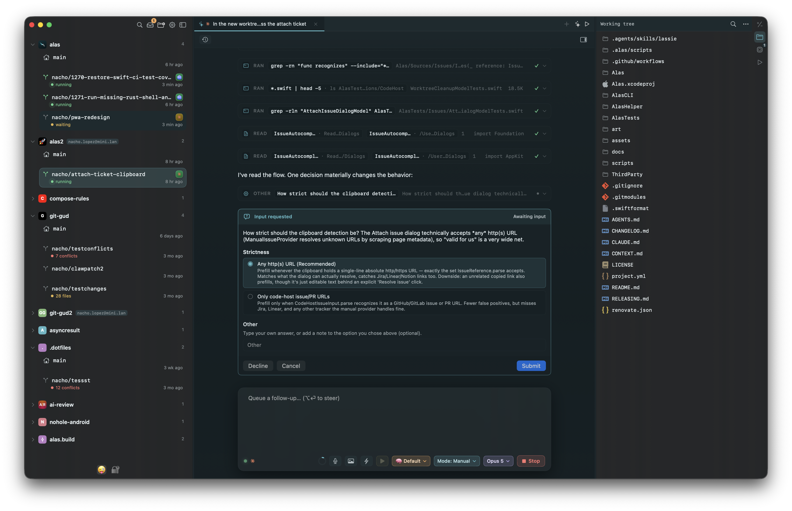
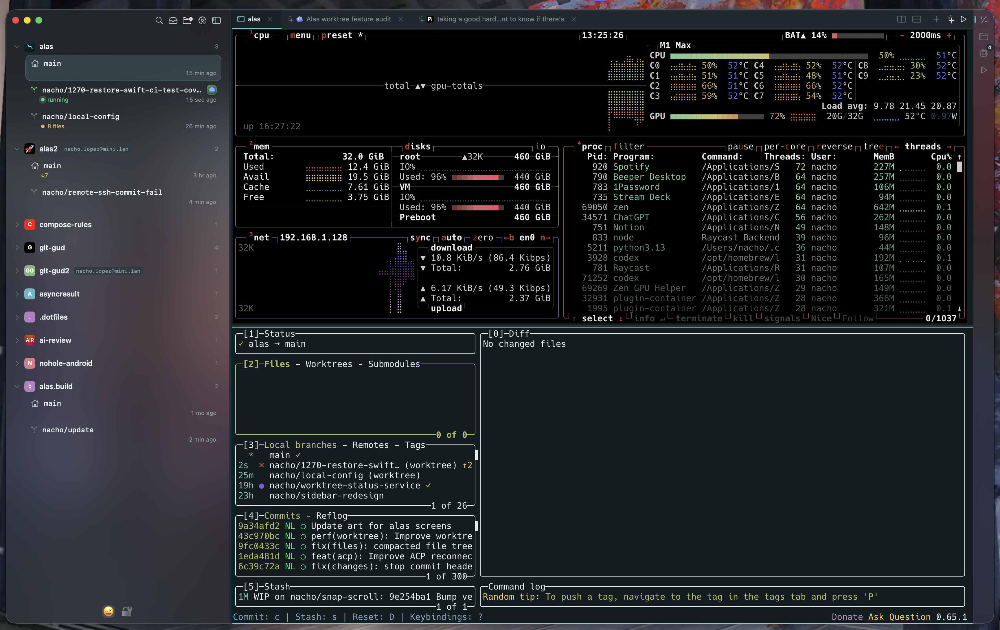
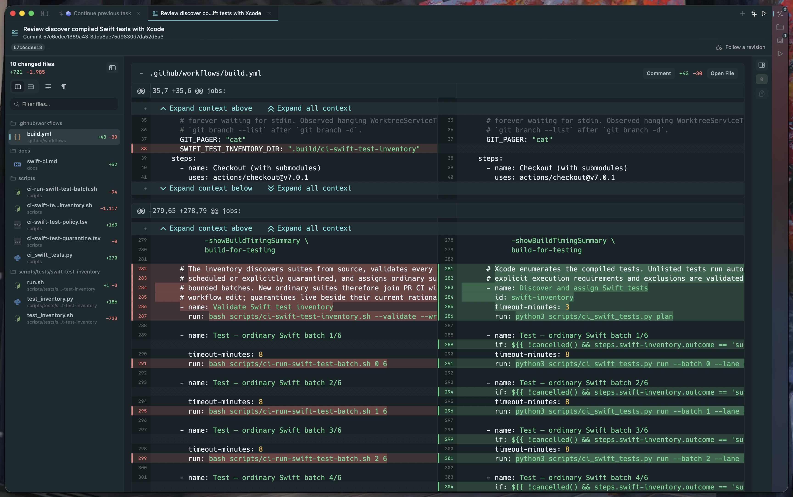
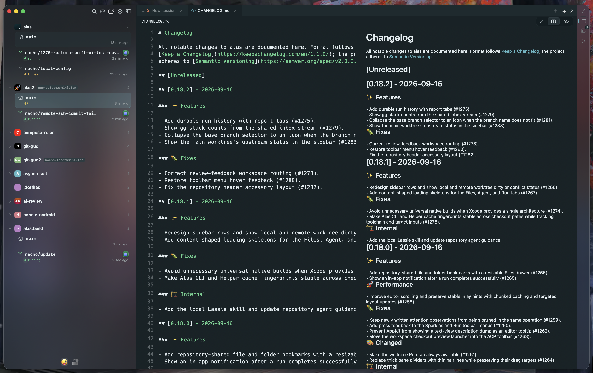

# Alas

**The workspace for the whole agent loop.**

Run coding agents in a terminal or a native chat pane, across every worktree —
on your Mac or over SSH — review their work with comments they can actually
answer, and merge without leaving the app. Then pick the whole thing up from
your phone. Native macOS, terminals built on
[libghostty](https://github.com/ghostty-org/ghostty).



## Install

```bash
brew install --cask mrmans0n/tap/alas
```

Or grab the signed DMG from [Releases](https://github.com/mrmans0n/alas/releases/latest).

## Why Alas

Spinning up parallel agents is table stakes now. The hard part is everything
around them: switching between a dozen worktrees without losing your place,
running an agent in a raw terminal *or* a structured chat depending on the task,
reviewing the diff — and getting your comments actually addressed — before you
ship, and not being chained to your desk while a long run finishes. Alas covers
that loop end to end: every agent, every worktree, one window.

## Features

- **Run agents two ways.** A long-lived Ghostty terminal or a native chat pane
  over [ACP](https://agentclientprotocol.com) — same worktree, your call. Tool
  calls, plans, and permission prompts render inline, and past sessions can be
  browsed and resumed. Works with Claude Code, Codex, Cursor, Gemini, OpenCode,
  Pi, and Copilot.

- **Parallel worktrees, one window.** Every repo lives in the sidebar with its
  linked worktrees underneath. Switching is instant; terminal sessions, tabs, and
  scroll positions persist per worktree.

  

- **Remote machines, same workspace.** Add a project on an SSH host — a
  connection assistant reads `~/.ssh/config` and bootstraps a helper on the
  other side. Terminals, agents, file editing, search, and git all work over the
  wire, and remote agent runs keep going in the helper even when you disconnect.

- **Agents can drive the app.** A standalone `alas` CLI works from any terminal
  — open files, switch or create worktrees, kick off reviews — and it's
  auto-injected into every ACP session as an MCP server. Agents use it to open
  files at the right line, send you notifications, spin up delegated sessions,
  and work through your review comments.

- **A review loop agents can close.** Review any diff — branch, commit, or
  range — from the ⇧⌘R palette, and drop inline comments anywhere, changed
  lines or not. Agents read, reply to, and resolve those comments through the
  built-in review tools, so feedback becomes fixes instead of copy-paste.

  

- **Ship without the round-trip.** GitHub PRs and GitLab MRs detected on your
  branch, AI-drafted titles and descriptions, and a review-evidence inspector
  that pulls CI logs, check results, and test output next to the diff. Merge
  in-app when it's green — merge queues included.

- **Drive from your phone.** Pair by QR, watch any session live, and take over a
  running desktop turn — send a prompt, stop a run, or answer a permission request
  from the couch. Push notifications fire when an agent needs you.

- **Harness-aware.** Detects Claude Code, Codex, Cursor, Gemini, and friends
  running in your worktrees and surfaces their state — busy, awaiting permission,
  awaiting input — as live badges in the sidebar. One-click hook install.

- **Git that gets out of the way.** File- and hunk-level staging, inline diffs
  with expandable context, stashes, per-file history, pull from upstream,
  AI-drafted commit messages, and a 3-way merge editor for conflicts — all
  without leaving the app.

- **A real editor underneath.** Tree-sitter syntax for 20+ languages, LSP-powered
  go-to-definition, hover docs, and completions, plus Markdown source-and-preview
  side-by-side.

  

- **Tabs for everything.** Terminals, agent sessions, file viewers, diffs, and
  Markdown — open in tabs, drag to reorder, restore on relaunch.

- **Native and signed.** No web weirdness, no Gatekeeper popups, no quarantine flags.

## Develop

Prerequisites: macOS 14 Sonoma+, Xcode 15.4+, `brew install xcodegen`.

```bash
xcodegen
xcodebuild -project Alas.xcodeproj -scheme Alas -destination 'platform=macOS' build
xcodebuild -project Alas.xcodeproj -scheme Alas -destination 'platform=macOS' test
```

Open the project in Xcode for normal development; rerun `xcodegen` after any change
to `project.yml`. See [AGENTS.md](AGENTS.md) for contributor conventions.

## Stack

Swift 5.9+ / SwiftUI on macOS 14+. Terminals embedded via the official Ghostty
Swift package; agent chat over the Agent Client Protocol. Tree-sitter for syntax,
LSP for code intelligence, swift-markdown for rendering. A Rust `alas` CLI
doubles as the MCP server injected into agent sessions; an in-process server
powers the phone client, and a bootstrapped helper runs the remote side of SSH
projects. Single Xcode app target generated from `project.yml` via
[xcodegen](https://github.com/yonaskolb/XcodeGen).

## License

[MIT](LICENSE).
