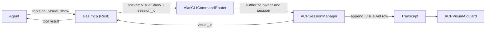

# ACP visual aids

Agents can show HTML inline in the ACP transcript: UI prototypes, layouts,
diagrams, and A/B/C choices the user should see rather than read. The
superpowers brainstorming skill does this today with a local HTTP server and a
browser tab. This design moves it into Alas, so every ACP agent gets it through
the built-in `alas` MCP server with no skill, no server process, and no URL.

## Goals

- Any ACP agent (Claude, Codex, OMP, others) can show a visual aid. The tool
  description is enough to discover and use it.
- The visual renders inside the transcript, next to the turn that produced it,
  and survives app restart.
- The user can answer an optional question attached to a visual. Clicking an
  element in the page preselects an answer on a native card. Submitting sends
  the answer to the agent as the user's next prompt.
- Agent-written HTML runs sandboxed. It can load scripts, styles, fonts and
  images from `https:` CDNs, and nothing else reaches the network.

## Non-goals

- Live updates of a shown visual. A later `visual_update(visual_id, html)` tool
  covers it; this design keeps the row id stable so that addition needs no
  model change.
- A fenced-block (```` ```alas-visual ````) entry point. Agents would need
  out-of-band instructions to know about it. It can be added later as a second
  entry point to the same row and renderer.
- Reading files from the worktree inside the page. Images come from `data:`,
  `blob:` or `https:`.
- Showing visuals when the built-in MCP server is disabled or shadowed by a
  project-defined server named `alas`.

## Decisions in brief

- **Entry point.** A `visual_show` tool on the built-in `alas` MCP server.
- **Storage.** A new `ACPMessage.visualAid` transcript row, persisted like any
  other row.
- **Renderer.** A `WKWebView` card modeled on `PluginWebPage`: custom scheme,
  non-persistent store, CSP header, content rules, isolated bridge world.
- **Network.** Read-only CDN access. `https:` for scripts, styles, images and
  fonts. `connect-src 'none'`, so no `fetch`, XHR or WebSocket.
- **Question.** Rendered with the existing `ACPUserInputPrompt` view inside the
  row, outside `transcript.pendingUserInputs`. It never blocks a turn.
- **Answer delivery.** A normal user prompt through the session queue. The tool
  call returns at once, so harness tool timeouts do not apply.

## Architecture and data flow



### MCP tool

`visual_show` lives in `all_tool_definitions()` in
`AlasCLI/crates/alas/src/mcp.rs` and is available to root and delegated
sessions.

Arguments:

| Field | Type | Rules |
|---|---|---|
| `title` | string | Required. 1 to 120 characters. |
| `html` | string | Required. Non-empty, at most 512 KiB of UTF-8. |
| `question` | object | Optional. See [Question flow](#question-flow). |

The tool description tells the agent:

- when to use it: content the user should see, such as UI prototypes, layouts,
  diagrams and visual comparisons; not for text answers;
- that a fragment gets wrapped in the Alas frame template and a document
  starting with `<!DOCTYPE` or `<html` is used as is;
- which frame template classes exist (listed under [Frame template](#frame-template));
- that `data-choice="<option id>"` on an element links it to a question option;
- that the answer, if any, arrives as the user's next message, so the agent
  should end its turn.

`command_for_tool` validates the arguments, returns JSON-RPC `-32602` on bad
input, and maps the call to a new `alas_client::Command::VisualShow`. The app
socket reply carries no free-form object, so the app answers
`AlasCLIResponse.text(["{\"visual_id\":\"<uuid>\"}"])`, the convention other
data-returning commands use. `tool_result` parses that line and formats it as
text:

```
Shown to the user as visual <uuid>. Their selection, if any, arrives as their
next message. End your turn unless you have more to show.
```

The HTTP MCP transport caps a whole request at 1 MiB today. JSON escaping can
grow a valid 512 KiB `html` past that, so the cap rises to 4 MiB.

The human `alas` CLI gets no `visual` subcommand: a terminal caller has no
transcript to show it in. The `mcp.rs` comment claiming tools mirror the CLI
1:1 gets corrected.

### App routing

`AlasCLIRequest` decodes the new command. `AlasCLICommandRouter` handles it
before generic origin resolution, like the session commands. Requests without
a `session_id`, or whose `session_id` is not a live ACP session, fail with
`visual_show is only available to ACP agent sessions`. The router validates
the same limits as the Rust side before touching the transcript.

AppState authorizes the preview closure with `isAuthorizedACPWriter(sessionID:owner:)`:
the session's owner matches, this process is the writer, and the owner has an
open ACP tab for that session. The preview closure keeps its terminal
fallback. `visual_show` uses `isAuthorizedACPSessionWriter(sessionID:owner:)`,
which is the same check without the tab requirement: appending a transcript
row needs no visible tab, and delegated children from `session_new` usually
have none.

`ACPSessionManager.showVisualAid` appends the row through the session runner
and waits until that exact row is written, the way
`appendDelegatedNotice` waits for its notice, then replies with the visual id.
It refuses while the session is merging a fork, like `enqueuePrompt` does.

### Transcript row

```swift
struct ACPVisualAid: Codable, Equatable, Sendable {
    let id: UUID
    let title: String
    let html: String
    let question: Question?
    var answer: Answer?
    let createdAt: Date

    struct Question: Codable, Equatable, Sendable {
        let prompt: String
        let options: [Option]          // id, label
        let allowMultiple: Bool
    }

    enum Answer: Codable, Equatable, Sendable {
        case answered(selectedOptionIds: [String], note: String?, at: Date)
        case dismissed(at: Date)
    }
}
```

`ACPMessage` gets `case visualAid(ACPVisualAid)` and `ACPMessageWire` the same
case. The persisted `kind` is `visual_aid` and the payload is the struct
itself. `kind` is stored as text, so the SQLite schema needs no column change.
The row's stable identity is the visual id.

The harness also reports its own `tool_call` for `visual_show`, so that row
already exists when the app appends the visual and the visual lands right
after it. `ACPToolCallPresentation.resolve` gets a rule, checked before the
broad MCP rule, for tool calls whose name or title contains `visual_show`:
label "Visual aid", icon `rectangle.on.rectangle`, MCP style. The one-line
target comes from the existing target rule. The HTML stays in the collapsed
card's raw input.

Every exhaustive switch over `ACPMessage` gets a case:

- `session_read` and `session_search` emit one `tool` entry,
  `visual aid: <title>`, plus the answer when present. They never include the
  HTML.
- Forking drops the row, as it already drops tool calls, plans and notices:
  the fork snapshot carries only user and agent text. The fork resolver
  matches visual rows by id so a visual before the fork point does not fail
  the snapshot with `transcriptMismatch`.
- Remote clients (the phone web client) get a hidden placeholder row, the
  marker background-task rows use, so they show nothing and their history
  cursor still advances. Rendering visuals there is a follow-up.
- A native subagent's inline child transcript shows the visual as a title
  line, without a web view.
- The visual counts as agent-side progress, ends an agent text run, and is an
  assistant row in the minimap.
- Plan filtering and tool grouping treat it as an ordinary visible row and
  never group it with tool calls.

Downgrade: older builds decode an unknown `kind` as a system notice reading
`(unknown message kind: visual_aid)` and keep loading the session
(`ACPMessageCodec` and `ACPMessageWire` fallback, hydrator skips only
malformed rows). That is acceptable; no change needed.

## Renderer and sandbox

### `VisualAidWebPolicy`

A pure enum, testable without a web view, mirroring `PluginWebPolicy`.

- Scheme `alas-visual`. The document URL is `alas-visual://<visual-id>/`.
- The scheme handler serves exactly that URL. Other hosts, paths, queries,
  users and ports get 404.
- Response headers: the CSP below, `X-Content-Type-Options: nosniff`,
  `X-DNS-Prefetch-Control: off`, `Cache-Control: no-store`.
- CSP, sent as a header and repeated in a `<meta>` tag:

  ```
  default-src 'none'; script-src 'unsafe-inline' https:;
  style-src 'unsafe-inline' https:; img-src data: blob: https:;
  font-src data: https:; connect-src 'none'; frame-src 'none';
  worker-src 'none'; form-action 'none'; base-uri 'none'
  ```

- Content rules: block everything, then allow `alas-visual:`, `https:` for
  `script`, `style-sheet`, `image` and `font` resource types, `data:` and
  `blob:` for images, and `data:` for fonts. Rules and CSP agree: no `blob:`
  fonts. The rule list compiles once per app run under its own identifier.
- Navigation: only the document URL in the main frame. A clicked `https` link
  opens in the default browser. Everything else is cancelled.
- Wrapping: `html` that starts (after whitespace and comments) with
  `<!DOCTYPE` or `<html`, case-insensitive, is a full document and is served
  byte for byte as written: the CSP already arrives as an HTTP header, so no
  `<meta>` is inserted. The page pushes the theme variables after load through
  the bridge. Anything else is a fragment and goes inside the frame template.

The page holds only HTML the agent wrote. It has no Alas data, no file access,
no persistent storage and no `connect-src`. An `https:` image GET can carry
data out, but the only data the page has is what the agent already had. That
makes `'unsafe-inline'` and `https:` loads acceptable here, where the plugin
sandbox forbids them.

### `VisualAidWebPage`

Owns one `WKWebView`. Configuration matches `PluginWebPage`: non-persistent
data store, `javaScriptCanOpenWindowsAutomatically = false`, element
fullscreen off, media requires user action, link previews off, inspectable in
DEBUG builds. The document loads only after the content rules are in place;
if they fail to compile, the page never loads.

A bridge script runs in an isolated `WKContentWorld` that page scripts cannot
reach. It reports three things to the app:

- content height, from a `ResizeObserver` on the document element;
- trusted clicks on elements with a `data-choice` attribute, as the attribute
  value;
- trusted clicks on links, which Alas opens in the default browser when they
  are `https`.

The app calls back into the same world to mark the selected `data-choice`
elements (`selected` class) and to push theme variables when the theme
changes.

A WebContent crash puts the page in a stopped state the card shows with a
Reload button. After 3 crashes the page stays stopped.

### `ACPVisualAidCard`

- Header: title, a pop-out button, and a "Copy HTML" button that puts the raw
  `html` argument on the clipboard.
- Body: height follows the reported content height, clamped to 120 to 720
  points. Taller content scrolls inside the card.
- The question card (next section) sits below the body in the same row.
- Pop-out opens a `Tab.visualAid(VisualAidTabState)` center tab carrying the
  session id and visual id. The tab reads the visual from the live session's
  transcript and shows "Visual unavailable" when either is gone. Visual tabs
  are not restored on relaunch (`isRestorable` is false), so no restore-time
  validation is needed. For workspace checkouts the tab is a shared session
  tab, like web previews.

### Live page budget

Each web view costs a WebContent process.

- The card creates its page on appear and closes it on disappear, never
  during body evaluation or measurement. Visual rows opt out of the
  scroller's row parking, so a released row does not keep a page alive.
- At most 4 visual pages are live across the app, counted per card instance
  (the inline card and its pop-out tab are two). When a fifth page is needed,
  the least recently admitted one is closed and its card shows a placeholder
  with a "Show visual" button.

### Frame template

An Alas-owned HTML resource. Fragments go inside it. It provides the class set
the superpowers companion uses, so existing agent habits carry over:
`options`, `option`, `letter`, `content`, `cards`, `card`, `card-image`,
`card-body`, `mockup`, `mockup-header`, `mockup-body`, `split`, `pros-cons`,
`pros`, `cons`, `mock-nav`, `mock-sidebar`, `mock-content`, `mock-button`,
`mock-input`, `placeholder`, `subtitle`, `section`, `label`. Options with
`data-choice` get a selected style driven by the bridge, not by page script.

Colors come from the Alas theme through `PluginWebPolicy.cssVariables(theme)`,
called directly. The template's `{{HEAD}}` slot holds the CSP `<meta>` and the
theme variables, baked in for fragments. Full documents never pass through the
template; `VisualAidWebPage` pushes their variables after load.

## Question flow

`question` argument:

| Field | Type | Rules |
|---|---|---|
| `prompt` | string | Required. 1 to 500 characters. |
| `options` | array of `{id, label}` | 2 to 8 items. `id` unique, 1 to 64 characters, `[A-Za-z0-9_-]`. `label` 1 to 200 characters. |
| `allow_multiple` | bool | Optional, default false. |

One question per visual. An agent with more questions shows more visuals.

### Rendering

The row renders the existing `ACPUserInputPrompt` with an
`ACPUserInputRequest` built from the question:

- one required choice field keyed `choice`, `string` for single select or
  `array` for multi-select;
- one optional free-text field keyed `note`;
- a new `Source.visualAid(UUID)` case. `ACPElicitationCoordinator` gets
  unreachable branches for it, because these requests never enter its queue.

`ACPUserInputPrompt` gets a second initializer that takes an existing
`ACPUserInputFormState`, so page clicks can drive the same form the native
controls edit. The form states live on `ACPSession`, keyed by visual id, so an
unsent selection survives the row scrolling out of the mount band.

The request never enters `transcript.pendingUserInputs`. That list holds
JSON-RPC requests that block a turn, and it also drives next-prompt
suggestions, session summaries and attention badges. A visual's question
blocks nothing; the user may ignore it and type in the composer.

### Page clicks

The bridge reports a `data-choice` click with the attribute value.
`ACPVisualAidQuestionForm.choiceField(for:in:)` (pure) returns the choice
field when the id names one of the question's options, and nil otherwise.
The card then calls `ACPUserInputFormState.toggle(_:for:)`, which already
replaces the selection for single select and toggles it for multi-select.

With no question, or after an answer, clicks do nothing. Nothing reaches the
agent until the user submits.

### Submit and dismiss

Submit:

1. Build the prompt text with `ACPVisualAidQuestionForm.answerPrompt(for:answer:)`
   (pure):

   ```
   [Visual aid: Homepage layout] Which layout feels right?
   Selected: b (Two column)
   Note: Keep the sidebar collapsible.
   ```

   Multi-select lists every selected option on the `Selected:` line, comma
   separated, in the question's option order. The `Note:` line appears only
   when the note is non-empty.
2. `ACPSessionManager.answerVisualAid` stores `answer = .answered(...)` on the
   row and persists it. The card switches to a read-only summary, for example
   "Answered: b, Two column". A second submit finds the row answered and does
   nothing, which is what keeps it from sending twice.
3. It starts `ACPSessionManager.sendPrompt`, the path the composer and the
   phone client use, so the answer shows as the user's own message and waits in
   the queue if a turn is running. `answerVisualAid` does not wait for the
   send to finish: `sendPrompt` reports back when the agent's turn ends, and
   not at all when a newer prompt supersedes this one or the connection is
   replaced, so waiting would hold the card, or hang.
4. If `sendPrompt` reports failure, the answer is cleared, on the session's
   transcript directly so it happens even when the runner is already gone, and
   persisted when a runner still holds the lease. The question becomes
   editable again and the card shows an inline error. A report that never
   arrives leaves the answer in place, which is right: a superseded prompt was
   still delivered.

Storing the answer first means a quit while the prompt is in flight leaves an
answered card next to the user's message, never an open question whose answer
was already sent.

Dismiss stores `answer = .dismissed` and sends nothing. Answered or dismissed
questions do not reopen. To revise, the agent shows a new visual.

Delegated child sessions behave the same way: the answer goes to the child
that showed the visual and is not forwarded to the parent.

## Errors

| Case | Behavior |
|---|---|
| Invalid arguments | Rust returns `-32602` with the failing rule. No socket call. |
| No `session_id` | Error: `visual_show is only available to ACP agent sessions`. |
| Session not authorized (owner mismatch, not the writer) or fork merging | Error: `This session can't show visuals right now.` No row. |
| Built-in MCP disabled or shadowed | The tool is not listed. Documented, no fallback. |
| Content rules fail to compile | Card shows "Couldn't set up the visual's sandbox". The page never loads. |
| WebContent process crash | Card shows "Visual stopped" with Reload. After 3 crashes for one card, it stays on the placeholder. |
| CDN unreachable | The page renders without that resource. No special handling. |
| Answer send fails | Answer cleared, card editable, inline error. |

## Testing

Following the repository testing policy: pure decisions get tests, views do
not.

- `VisualAidWebPolicyTests` (new suite, parameterized):
  - scheme handler accepts only the document URL and returns 404 for other
    hosts, paths, queries, users and ports;
  - navigation rule;
  - full document versus fragment detection, including leading whitespace,
    comments and case;
  - document assembly puts fragments inside the template and keeps full
    documents intact;
  - the CSP keeps `connect-src 'none'` and `form-action 'none'`;
  - the page budget closes the least recently admitted page.
- `ACPVisualAidTests` (new suite): limit validation, `choiceField`,
  `answerPrompt`, and answer extraction from form content.
- `ACPMessageTests`: `.visualAid` round trips with no answer, with an answer,
  and dismissed.
- `ACPSessionForkPolicyTests`: a visual before the fork point does not fail
  the snapshot and is not copied.
- `ACPSessionTranscriptReaderTests`: the visual entry has title and answer,
  never HTML.
- `ACPToolCallPresentationTests`: `visual_show` resolves to "Visual aid", not
  "MCP".
- `mcp.rs`: `visual_show` in `tools/list` for root and delegated sessions;
  validation failures for missing `html`, oversize `html`, too few options,
  duplicate option ids and bad id characters; the result text carries the
  visual id.
- `AlasCLIRequestTests`: `visual_show` decodes, and out-of-limit params are
  malformed.
- `AlasCLICommandRouterTests`: a caller that is not an ACP session is
  rejected.

Smoke run in the app, with a Claude agent and a Codex agent:

1. Ask for a mock that uses the Tailwind CDN. It renders, the card height fits
   the content, and a `fetch()` from the page fails.
2. Ask for a visual with a question. Clicking a `data-choice` element
   preselects the native card. Submitting queues the prompt and the agent
   receives it.
3. Restart the app. The visual and its answer come back.
4. Pop the visual out to a tab.
5. Show more than 4 visuals. The least recently shown one falls back to its
   placeholder.

## Later

- Phone web client support: the client is HTML already, so it can likely
  render the stored `html` in a sandboxed iframe. Needs the gateway to send
  the visual (title, html, question, answer) in place of the hidden row, and
  a client-side answer path through `sendPrompt`.
- `visual_update(visual_id, html)` replaces `html` on an existing row and
  reloads its live page.
- An optional `alas-visual` fenced block as a second entry point to the same
  row and renderer.
- Returning a PNG capture in the tool result so the agent can see what it
  rendered.
