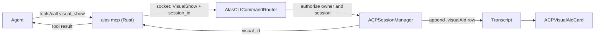

# ACP visual aids

Agents can show HTML inline in the ACP transcript: UI prototypes, layouts,
diagrams, and A/B/C choices the user should see rather than read. The
superpowers brainstorming skill does this today with a local HTTP server and a
browser tab. This design moves it into Alas, so every ACP agent gets it through
the built-in `alas` MCP server with no skill, no server process, and no URL.

## Goals

- Any ACP agent (Claude, Codex, OMP, others) can show a visual aid. The tool
  description is enough to discover and use it.
- The visual renders inside the transcript, next to the turn that produced it,
  and survives app restart.
- The user can answer an optional question attached to a visual. Clicking an
  element in the page preselects an answer on a native card. Submitting sends
  the answer to the agent as the user's next prompt.
- Agent-written HTML runs sandboxed. It can load scripts, styles, fonts and
  images from `https:` CDNs, and nothing else reaches the network.

## Non-goals

- Live updates of a shown visual. A later `visual_update(visual_id, html)` tool
  covers it; this design keeps the row id stable so that addition needs no
  model change.
- A fenced-block (```` ```alas-visual ````) entry point. Agents would need
  out-of-band instructions to know about it. It can be added later as a second
  entry point to the same row and renderer.
- Reading files from the worktree inside the page. Images come from `data:`,
  `blob:` or `https:`.
- Showing visuals when the built-in MCP server is disabled or shadowed by a
  project-defined server named `alas`.

## Decisions in brief

- **Entry point.** A `visual_show` tool on the built-in `alas` MCP server.
- **Storage.** A new `ACPMessage.visualAid` transcript row, persisted like any
  other row.
- **Renderer.** A `WKWebView` card modeled on `PluginWebPage`: custom scheme,
  non-persistent store, CSP header, content rules, isolated bridge world.
- **Network.** Read-only CDN access. `https:` for scripts, styles, images and
  fonts. `connect-src 'none'`, so no `fetch`, XHR or WebSocket.
- **Question.** Rendered with the existing `ACPUserInputPrompt` view inside the
  row, outside `transcript.pendingUserInputs`. It never blocks a turn.
- **Answer delivery.** A normal user prompt through the session queue. The tool
  call returns at once, so harness tool timeouts do not apply.

## Architecture and data flow



### MCP tool

`visual_show` lives in `all_tool_definitions()` in
`AlasCLI/crates/alas/src/mcp.rs` and is available to root and delegated
sessions.

Arguments:

| Field | Type | Rules |
|---|---|---|
| `title` | string | Required. 1 to 120 characters. |
| `html` | string | Required. Non-empty, at most 512 KiB of UTF-8. |
| `question` | object | Optional. See [Question flow](#question-flow). |

The tool description tells the agent:

- when to use it: content the user should see, such as UI prototypes, layouts,
  diagrams and visual comparisons; not for text answers;
- that a fragment gets wrapped in the Alas frame template and a document
  starting with `<!DOCTYPE` or `<html` is used as is;
- which frame template classes exist (listed under [Frame template](#frame-template));
- that `data-choice="<option id>"` on an element links it to a question option;
- that the answer, if any, arrives as the user's next message, so the agent
  should end its turn.

`command_for_tool` validates the arguments, returns JSON-RPC `-32602` on bad
input, and maps the call to a new `alas_client::Command::VisualShow`. The app
returns `{ "visual_id": "<uuid>" }`. `tool_result` formats it as text:

```
Shown to the user as visual <uuid>. Their selection, if any, arrives as their
next message. End your turn unless you have more to show.
```

### App routing

`AlasCLIRequest` decodes the new command. `AlasCLICommandRouter` resolves the
caller's `session_id` to an ACP session and reuses the existing ACP
authorization check (`AppState` `isAuthorized`): the session must belong to the
owner, the process must be the writer, and the ACP tab must be open. Requests
without a `session_id` (terminal or CLI callers) fail with
`visual_show is only available to ACP agent sessions`. The router validates
the same limits as the Rust side before touching the transcript.

`ACPSessionManager` appends the row through the session runner so it persists
on the normal path, then replies with the row id. It refuses while the session
is merging a fork, like `enqueuePrompt` does.

### Transcript row

```swift
struct VisualAid: Equatable, Sendable {
    let id: UUID
    let title: String
    let html: String
    let question: Question?
    var answer: Answer?
    let createdAt: Date

    struct Question: Equatable, Sendable {
        let prompt: String
        let options: [Option]          // id, label
        let allowMultiple: Bool
    }

    enum Answer: Equatable, Sendable {
        case answered(selectedOptionIds: [String], note: String?, at: Date)
        case dismissed(at: Date)
    }
}
```

`ACPMessage` gets `case visualAid(VisualAid)`. `ACPMessageCodec` gets a new
`kind` string. `kind` is stored as text, so the SQLite schema needs no column
change.

The harness also reports its own `tool_call` for `visual_show`, so that row
already exists when the app appends the visual and the visual lands right
after it. `ACPToolCallPresentation.resolve` gets a rule for tool names ending
in `visual_show`: label "Visual aid", target = title, compact one-line row.
The HTML stays in the collapsed card's raw input.

Every exhaustive switch over `ACPMessage` gets a case:

- `session_read` and `session_search` emit one line, `visual aid: <title>`,
  plus the answer when present. They never include the HTML.
- Forking copies the row.
- Plan filtering and tool grouping treat it as an ordinary visible row and
  never group it with tool calls.

Downgrade: the implementation must confirm how an older build decodes an
unknown `kind`. If one bad row fails the whole session hydration, the decoder
gets fixed to skip unknown kinds before this ships.

## Renderer and sandbox

### `VisualAidWebPolicy`

A pure enum, testable without a web view, mirroring `PluginWebPolicy`.

- Scheme `alas-visual`. The document URL is `alas-visual://<visual-id>/`.
- The scheme handler serves exactly that URL. Other hosts, paths, queries,
  users and ports get 404.
- Response headers: the CSP below, `X-Content-Type-Options: nosniff`,
  `X-DNS-Prefetch-Control: off`, `Cache-Control: no-store`.
- CSP, sent as a header and repeated in a `<meta>` tag:

  ```
  default-src 'none'; script-src 'unsafe-inline' https:;
  style-src 'unsafe-inline' https:; img-src data: blob: https:;
  font-src data: https:; connect-src 'none'; frame-src 'none';
  worker-src 'none'; form-action 'none'; base-uri 'none'
  ```

- Content rules: block everything, then allow `alas-visual:`, `https:` for
  `script`, `style-sheet`, `image` and `font` resource types, and `data:` and
  `blob:` for images and fonts. The rule list compiles once per app run under
  its own identifier.
- Navigation: only the document URL in the main frame. A clicked `https` link
  opens in the default browser. Everything else is cancelled.
- Wrapping: `html` that starts (after whitespace and comments) with
  `<!DOCTYPE` or `<html`, case-insensitive, is a full document and is served
  as is plus the injected theme variables. Anything else is a fragment and goes
  inside the frame template.

The page holds only HTML the agent wrote. It has no Alas data, no file access,
no persistent storage and no `connect-src`. An `https:` image GET can carry
data out, but the only data the page has is what the agent already had. That
makes `'unsafe-inline'` and `https:` loads acceptable here, where the plugin
sandbox forbids them.

### `VisualAidWebPage`

Owns one `WKWebView`. Configuration matches `PluginWebPage`: non-persistent
data store, `javaScriptCanOpenWindowsAutomatically = false`, element
fullscreen off, media requires user action, link previews off, inspectable in
DEBUG builds. The document loads only after the content rules are in place;
if they fail to compile, the page never loads.

A bridge script runs in an isolated `WKContentWorld` that page scripts cannot
reach. It reports two things to the app:

- content height, from a `ResizeObserver` on the document element;
- clicks on elements with a `data-choice` attribute, as the attribute value.

### `ACPVisualAidCard`

- Header: title, a pop-out button, and a "Copy HTML" button that puts the raw
  `html` argument on the clipboard.
- Body: height follows the reported content height, clamped to 120 to 720
  points. Taller content scrolls inside the card.
- The question card (next section) sits below the body in the same row.
- Pop-out opens `Tab.visualAid(sessionID, visualID)` in the center pane. The
  tab reads the HTML from the session's transcript. On restore, the tab is
  dropped if the session or row no longer exists.

### Live page budget

Each web view costs a WebContent process.

- A card outside the transcript render window creates no web view.
- At most 4 visual pages are live across the app. When a fifth card needs one,
  the least recently shown card gives up its page and shows a placeholder with
  a "Show visual" button.

### Frame template

An Alas-owned HTML resource. Fragments go inside it. It provides the class set
the superpowers companion uses, so existing agent habits carry over:
`options`, `option`, `letter`, `content`, `cards`, `card`, `card-image`,
`card-body`, `mockup`, `mockup-header`, `mockup-body`, `split`, `pros-cons`,
`pros`, `cons`, `mock-nav`, `mock-sidebar`, `mock-content`, `mock-button`,
`mock-input`, `placeholder`, `subtitle`, `section`, `label`. Options with
`data-choice` get a selected style driven by the bridge, not by page script.

Colors come from the Alas theme through `PluginWebPolicy.cssVariables(theme)`.
If that function reads better outside the plugin code, it moves to a shared
`WebThemeVariables` and both callers use it.

## Question flow

`question` argument:

| Field | Type | Rules |
|---|---|---|
| `prompt` | string | Required. 1 to 500 characters. |
| `options` | array of `{id, label}` | 2 to 8 items. `id` unique, 1 to 64 characters, `[A-Za-z0-9_-]`. `label` 1 to 200 characters. |
| `allow_multiple` | bool | Optional, default false. |

One question per visual. An agent with more questions shows more visuals.

### Rendering

The row renders the existing `ACPUserInputPrompt` with an
`ACPUserInputRequest` built from the question:

- one choice field, `string` for single select or `array` for multi-select;
- one optional free-text "Note" field;
- a new `Source.visualAid(UUID)` case.

The request never enters `transcript.pendingUserInputs`. That list holds
JSON-RPC requests that block a turn, and it also drives next-prompt
suggestions, session summaries and attention badges. A visual's question
blocks nothing; the user may ignore it and type in the composer.
`ACPElicitationCoordinator` never sees these requests.

### Page clicks

The bridge reports a `data-choice` click with the attribute value.
`VisualAidSelection.apply(choice:to:question:)` (pure) maps it:

- unknown id: no change;
- single select: the selection becomes that id;
- multi-select: that id toggles.

With no question, or after an answer, clicks do nothing. Nothing reaches the
agent until the user submits.

### Submit and dismiss

Submit:

1. Build the prompt text with `VisualAidAnswerPrompt.text(visual:answer:)`
   (pure):

   ```
   [Visual aid: Homepage layout] Which layout feels right?
   Selected: b (Two column)
   Note: Keep the sidebar collapsible.
   ```

   Multi-select lists every selected option on the `Selected:` line, comma
   separated. The `Note:` line appears only when the note is non-empty.
2. Enqueue it on the session queue as a user prompt with no delegated source,
   so it renders as the user's own message. Its queue id derives from the
   visual id, and the enqueue skips ids already queued or sent, the way
   `ACPSessionManager.enqueuePrompt` does, so a double submit enqueues once.
   If a turn is running, it waits in the queue like any queued prompt.
3. Only after the enqueue succeeds, store `answer = .answered(...)` on the row
   and persist it. The card switches to a read-only summary, for example
   "Answered: B, Two column".

If the enqueue fails (session gone or merging), the answer is not stored, the
card stays editable, and it shows an inline error.

Dismiss stores `answer = .dismissed` and sends nothing. Answered or dismissed
questions do not reopen. To revise, the agent shows a new visual.

Delegated child sessions behave the same way: the answer goes to the child
that showed the visual and is not forwarded to the parent.

## Errors

| Case | Behavior |
|---|---|
| Invalid arguments | Rust returns `-32602` with the failing rule. No socket call. |
| No `session_id` | Error: `visual_show is only available to ACP agent sessions`. |
| Session unauthorized, tab closed, or fork merging | The router's existing authorization error. No row. |
| Built-in MCP disabled or shadowed | The tool is not listed. Documented, no fallback. |
| Content rules fail to compile | Card shows "Couldn't set up the visual's sandbox". The page never loads. |
| WebContent process crash | Card shows "Visual stopped" with Reload. After 3 crashes for one card, it stays on the placeholder. |
| CDN unreachable | The page renders without that resource. No special handling. |
| Answer enqueue fails | Answer not stored, card editable, inline error. |

## Testing

Following the repository testing policy: pure decisions get tests, views do
not.

- `VisualAidWebPolicyTests` (new suite, parameterized):
  - scheme handler accepts only the document URL and returns 404 for other
    hosts, paths, queries, users and ports;
  - navigation rule;
  - full document versus fragment detection, including leading whitespace,
    comments and case;
  - the CSP keeps `connect-src 'none'` and `form-action 'none'`.
- `VisualAidSelection.apply` and `VisualAidAnswerPrompt.text` in the same
  suite: unknown id, single select replace, multi-select toggle, note present
  and absent.
- `ACPMessageCodec`: `.visualAid` round trips with no answer, with an answer,
  and dismissed, in the existing codec suite.
- `mcp.rs`: `visual_show` in `tools/list` for root and delegated sessions;
  validation failures for missing `html`, oversize `html`, too few options,
  duplicate option ids and bad id characters.
- Router: a caller without `session_id` is rejected, in the existing router
  suite.

Smoke run in the app, with a Claude agent and a Codex agent:

1. Ask for a mock that uses the Tailwind CDN. It renders, the card height fits
   the content, and a `fetch()` from the page fails.
2. Ask for a visual with a question. Clicking a `data-choice` element
   preselects the native card. Submitting queues the prompt and the agent
   receives it.
3. Restart the app. The visual and its answer come back.
4. Pop the visual out to a tab.
5. Show more than 4 visuals. The least recently shown one falls back to its
   placeholder.

## Later

- `visual_update(visual_id, html)` replaces `html` on an existing row and
  reloads its live page.
- An optional `alas-visual` fenced block as a second entry point to the same
  row and renderer.
- Returning a PNG capture in the tool result so the agent can see what it
  rendered.
